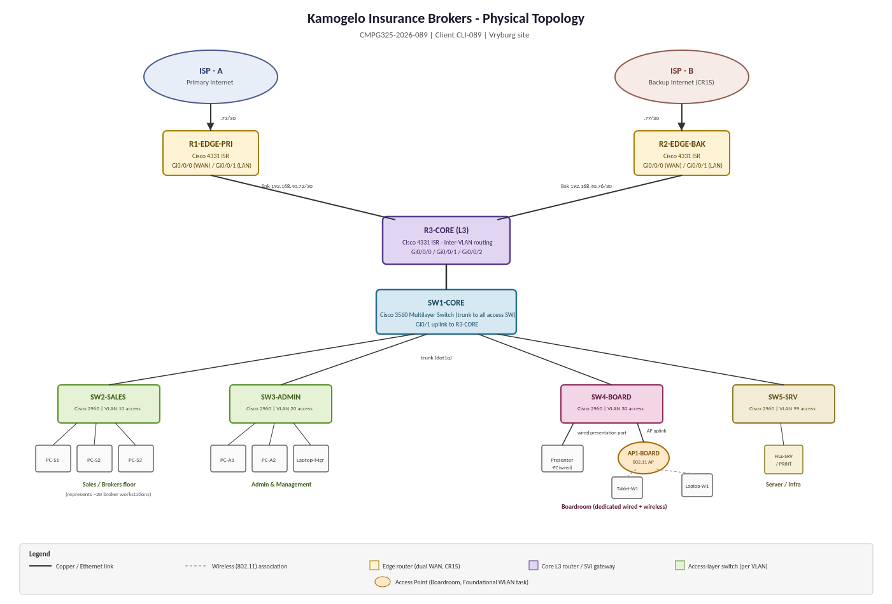
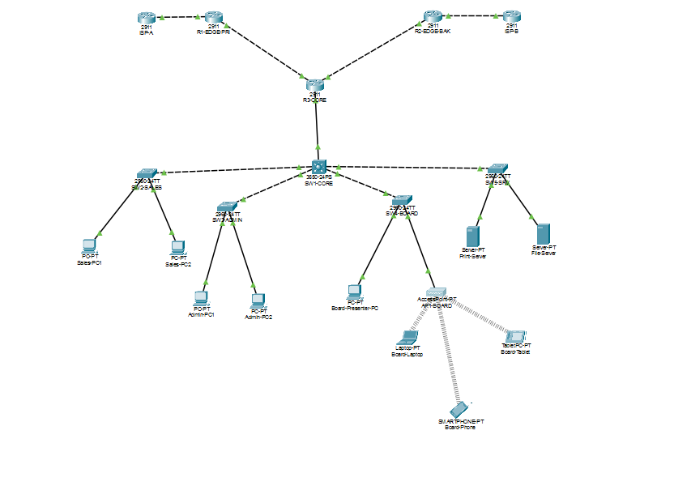

# 02 - Physical topology

A standard three-tier layout (edge, core, access) separates the WAN-facing edge from internal routing.

## 1. Devices

| Device | Model (Packet Tracer) | Role |
|---|---|---|
| R1-EDGE-PRI | 2911 | Primary edge router for ISP-A, NAT overload |
| R2-EDGE-BAK | 2911 | Backup edge router for ISP-B, NAT overload (CR15) |
| R3-CORE | 2911 | Inter-VLAN routing, DHCP, default routes, convergence point for both edge routers |
| SW1-CORE | 3650-24PS | Core switch; 802.1Q trunks to all access switches |
| SW2-SALES | 2960-24TT | Sales / Brokers access switch |
| SW3-ADMIN | 2960-24TT | Admin and Management access switch |
| SW4-BOARD | 2960-24TT | Boardroom access switch |
| SW5-SRV | 2960-24TT | Server / Infrastructure access switch |
| AP1-BOARD | Access Point-PT | Standalone boardroom access point |
| ISP-A, ISP-B | 2911 | Simulated ISPs; loopback 8.8.8.8 stands in for an Internet host |

Two separate edge routers were chosen instead of one router with two WAN interfaces, which would remain a single point of failure.

## 2. Cabling

| From | To | Cable |
|---|---|---|
| R3-CORE Gi0/0 | SW1-CORE Gi1/0/1 | Straight-through (trunk) |
| SW1-CORE Gi1/0/2 | SW2-SALES Gi0/1 | Cross-over (trunk) |
| SW1-CORE Gi1/0/3 | SW3-ADMIN Gi0/1 | Cross-over (trunk) |
| SW1-CORE Gi1/0/4 | SW4-BOARD Gi0/1 | Cross-over (trunk) |
| SW1-CORE Gi1/0/5 | SW5-SRV Gi0/1 | Cross-over (trunk) |
| R3-CORE Gi0/1 | R1-EDGE-PRI Gi0/0 | Cross-over |
| R3-CORE Gi0/2 | R2-EDGE-BAK Gi0/0 | Cross-over |
| R1-EDGE-PRI Gi0/1 | ISP-A Gi0/0 | Cross-over |
| R2-EDGE-BAK Gi0/1 | ISP-B Gi0/0 | Cross-over |
| SW2-SALES Fa0/1, Fa0/2 | Sales-PC1, Sales-PC2 | Straight-through |
| SW3-ADMIN Fa0/1, Fa0/2 | Admin-PC1, Admin-PC2 | Straight-through |
| SW4-BOARD Fa0/1 | Board-Presenter-PC | Straight-through |
| SW4-BOARD Fa0/2 | AP1-BOARD Port 0 | Straight-through |
| SW5-SRV Fa0/1, Fa0/2 | File-Server, Print-Server | Straight-through |

Wireless clients (Board-Laptop, Board-Phone, Board-Tablet) connect to AP1-BOARD over Wi-Fi and have no cables.

## 3. Meeting the boardroom constraint

SW4-BOARD gives the boardroom its own switch with two separate paths: a wired port (Fa0/1) to the presenter PC and a separate port (Fa0/2) feeding AP1-BOARD. Both are access ports in the same dedicated boardroom VLAN (VLAN 30).

## 4. Differences from the Milestone 1 diagram

The Milestone 1 diagram shows a Cisco 4331 ISR and a Catalyst 3560. The build uses 2911 routers (three built-in gigabit ports for R3-CORE) and a 3650-24PS, with the same roles. The end devices are a representative sample (two PCs per department, two servers, three wireless clients).
