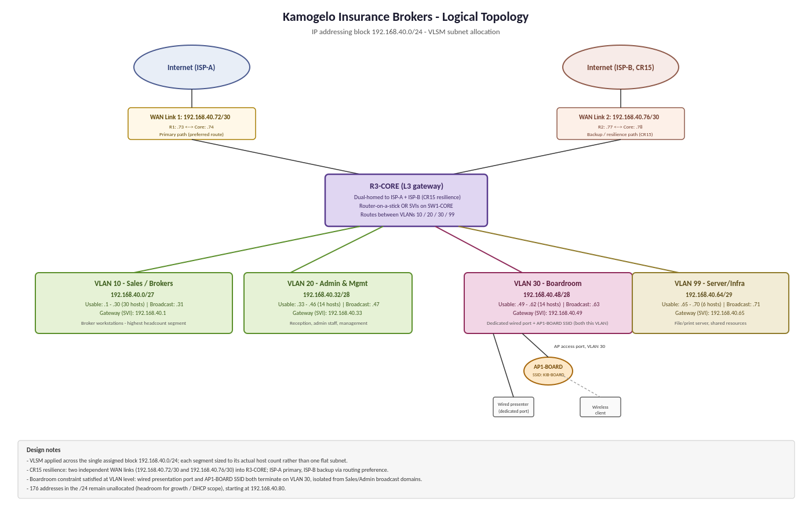

# 03 - Logical topology

## 1. VLANs

| VLAN | Name | Subnet | Gateway | Purpose |
|---|---|---|---|---|
| 10 | Sales / Brokers | 192.168.40.0/27 | 192.168.40.1 | Largest segment, broker workstations |
| 20 | Admin and Management | 192.168.40.32/28 | 192.168.40.33 | Reception, admin staff, management |
| 30 | Boardroom | 192.168.40.48/28 | 192.168.40.49 | Wired presentation port and AP1-BOARD |
| 99 | Server / Infrastructure | 192.168.40.64/29 | 192.168.40.65 | File and print servers |

## 2. Inter-VLAN routing

R3-CORE routes between the VLANs using router-on-a-stick: one 802.1Q trunk (R3-CORE Gi0/0 to SW1-CORE Gi1/0/1) carries four subinterfaces, each acting as the gateway of its VLAN.

| Subinterface | VLAN | Address |
|---|---|---|
| Gi0/0.10 | 10 | 192.168.40.1/27 |
| Gi0/0.20 | 20 | 192.168.40.33/28 |
| Gi0/0.30 | 30 | 192.168.40.49/28 |
| Gi0/0.99 | 99 | 192.168.40.65/29 |

SW1-CORE trunks to the four access switches and does not route.

## 3. DHCP

R3-CORE is the DHCP server for VLANs 10, 20 and 30. The servers (VLAN 99) and the boardroom presenter PC use static addresses. Details are in [04](04-ip-addressing-plan.md).

## 4. Internet access and NAT

R3-CORE has two links, one to each edge router:

- WAN Link 1: 192.168.40.72/30 (R3-CORE .73, R1-EDGE-PRI .74), then ISP-A. This is the primary path.
- WAN Link 2: 192.168.40.76/30 (R3-CORE .77, R2-EDGE-BAK .78), then ISP-B. This is the backup path.

R1-EDGE-PRI and R2-EDGE-BAK each translate the internal 192.168.40.0/24 block with NAT overload on their ISP-facing interface. Failover is covered in [07](07-cr15-dual-internet.md).

## 5. Boardroom isolation

An extended ACL (`BOARD-IN`) on R3-CORE Gi0/0.30 blocks traffic between the boardroom and the Sales and Admin VLANs while leaving the server VLAN and the Internet reachable.

## 6. Example traffic flows

| Flow | Path |
|---|---|
| Sales PC to the Internet | Sales PC, SW2-SALES, SW1-CORE, R3-CORE (Gi0/0.10), R1-EDGE-PRI, ISP-A |
| Wireless boardroom client to the File-Server | Client, AP1-BOARD, SW4-BOARD, SW1-CORE, R3-CORE (Gi0/0.30 to Gi0/0.99), SW1-CORE, SW5-SRV |
| Wireless client to the wired presenter PC | Client, AP1-BOARD, SW4-BOARD, presenter PC (stays in VLAN 30, not routed) |
